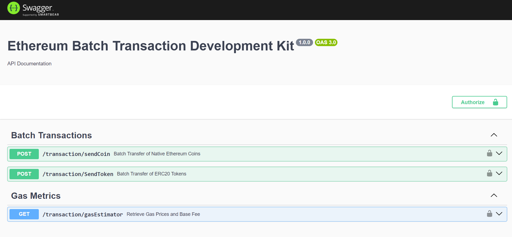

# Blockchain Transaction Service

## Overview

The Blockchain Transaction Service is a `NestJS` application designed to facilitate batch processing of blockchain transactions. It supports sending coins and tokens, as well as retrieving gas estimation data for transactions. The service is built with a `clean architecture` approach, incorporating modules for separation of concerns and scalability.

## Features

- **`Send Coins`**: Process batch transactions for sending coins.
- **`Send Tokens`**: Handle batch transactions for sending tokens.
- **`Gas Estimation`**: Retrieve gas estimation data for transaction processing.

## Installation

### Prerequisites

- `Docker`

### Setup

1. **Pull the Image from `Docker Hub`**
   ```bash
   docker pull arrjunpradeep/sdk:latest
   docker pull postgres:13.15-alpine
   ```

2. **Create a Network**
   ```bash
   docker network create my-network
   ```

3. **Ensure You Have the Required Environment Files**

   Create an `env` folder in the root of your project with the following files:

   * `app.env` : 
   ```bash
   APP_HOST=0.0.0.0
   APP_PORT=3369
   ```

   * `blockchain.env` : 
   ```bash
   NODE_URL=XXXXX
   PRIVATE_KEY=XXXXX
   EXPLORER_API_KEY=XXXXX
   CHAIN_ID=XXXXX
   BATCH_CONTRACT=XXXXX
   ```

   * `database.env` : 
   ```bash
   POSTGRES_TYPE=postgres
   POSTGRES_HOST=postgres_db
   POSTGRES_PORT=5432
   POSTGRES_DB=XXXXX
   POSTGRES_USER=XXXXX
   POSTGRES_PASSWORD=XXXXX
   POSTGRES_SYNCHRONIZE=false
   POSTGRES_AUTO_LOAD_ENTITIES=true
   ```
   

4. **Run PostgreSQL Container**
   ```bash
   docker run -d --name postgres_db --network my-network --env-file ./env/database.env -p 5432:5432 postgres:13.15-alpine
   ```

5. **Run Application Container**
   ```bash
   docker run -d --name sdk --network my-network  --env-file ./env/app.env --env-file ./env/blockchain.env -p 3369:3369 arrjunpradeep/sdk:latest
   ```

6. **Check Container Logs**
   ```bash
   docker logs sdk
   docker logs postgres_db
   ```

7. **Access API Documentation**

   To test our SDK, go to http://localhost:3369/swagger for API documentation and testing

   

- ***Notes :***

   *****Ensure your .env files (app.env, blockchain.env, and database.env) are correctly configured and located in the ./env directory. The PostgreSQL container should be up and running before the application container to avoid connectivity issues.*****